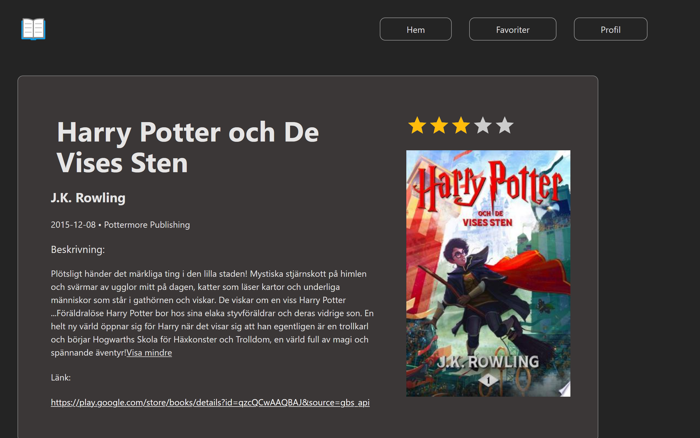
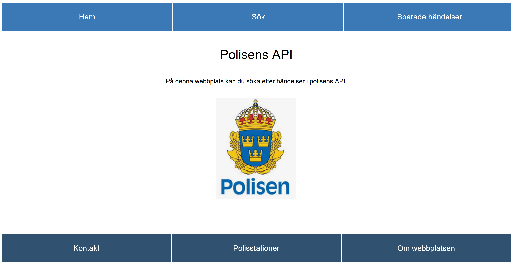
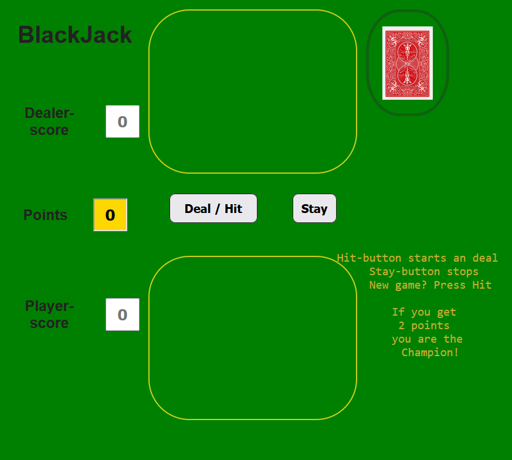

# 👋 Hej, jag heter Richard  
🎓 Studerar JavaScriptutveckling på IT-Högskolan  
💻 Intresserad av fullstack, frontend och webbutveckling  

---

## 🚀 Teknologier

  

  

## 📂 Projekt

Här är några av de projekt jag byggt själv och med andra. Klicka på bilderna eller länken för att se mer på github.

<table>
  
  <tr>
    <td width="50%" align="center">
      
    </td>
    <td width="50%" align="center">
      
    </td>
  </tr>
  
  <tr>
    <td width="50%" align="center">
      <a href="https://github.com/richardMattsson/Cloudy">En väderapp byggd med React Native</a>
    </td>
    <td width="50%" align="center">
       <a href="https://github.com/richardMattsson/Library-code">Bibliotek där du kan logga in och spara dina favoritböcker</a>
    </td>
  </tr>
  
  <tr>
    <td width="50%" align="center">
      
    </td>
     <td width="50%" align="center">
      
    </td>
  </tr>

  <tr>
    <td width="50%" align="center">
      <a href="https://github.com/richardMattsson/Code-for-police-events">Polishändelser.</a>
    </td>
    <td width="50%" align="center">
     <a href="http://46.225.10.139:81/">Trygghetskollen</a>
    </td>
    
  </tr>
  
  <tr>
    <td width="50%" align="center">
      
    </td>
    <td width="50%" align="center">
      
    </td>
  </tr>

  <tr>
    <td width="50%" align="center">
      <a href="https://github.com/richardMattsson/blackjack2/">Blackjack där du kan spela mot datorn.</a>
    </td>
    <td width="50%" align="center">
    <a href="http://46.225.10.139/">Fullstack webshop app tested with cypress</a>
    </td>
  </tr>
</table>

## 📫 Kontakt

<!---
richardMattsson/richardMattsson is a ✨ special ✨ repository because its `README.md` (this file) appears on your GitHub profile.
You can click the Preview link to take a look at your changes.
--->
